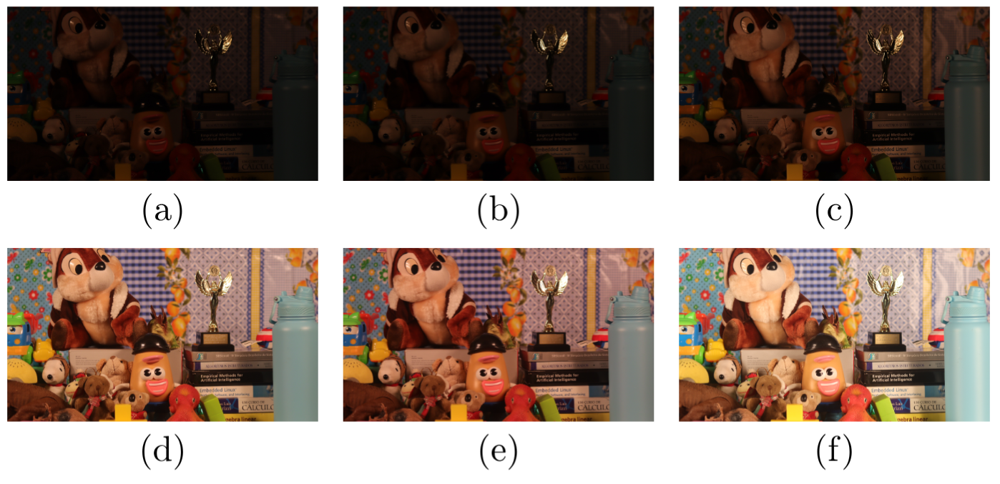
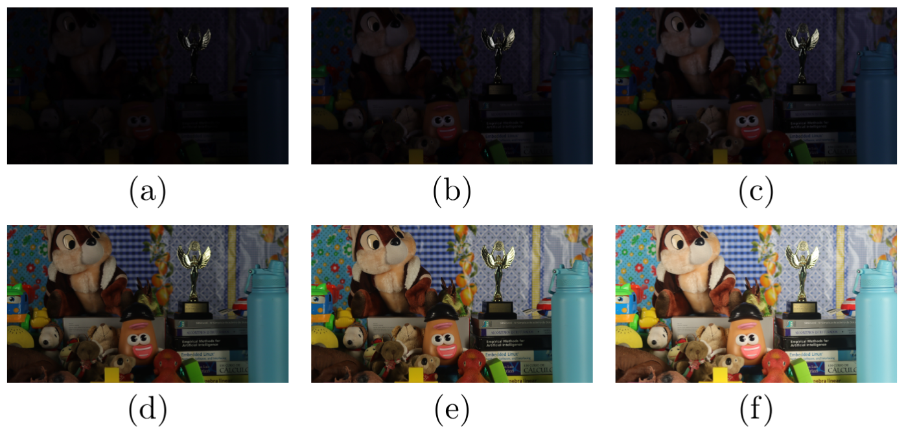
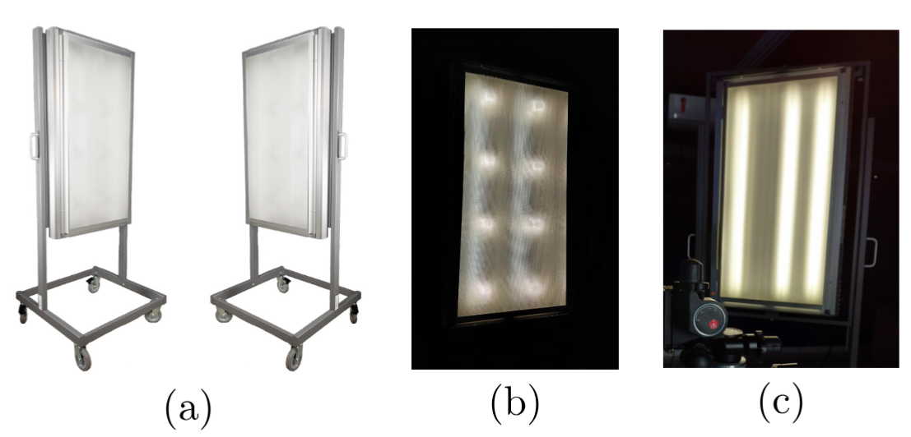
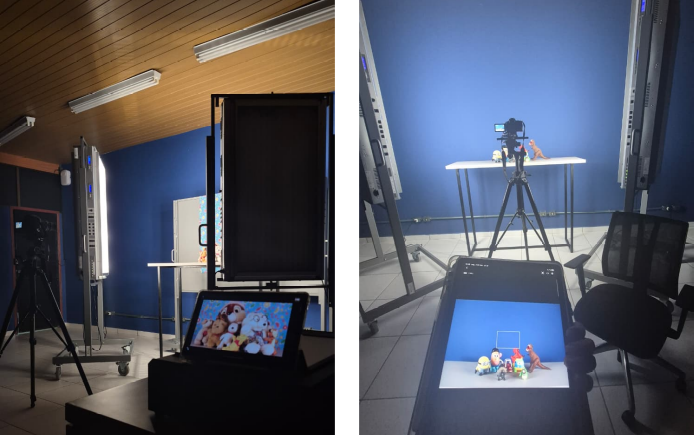
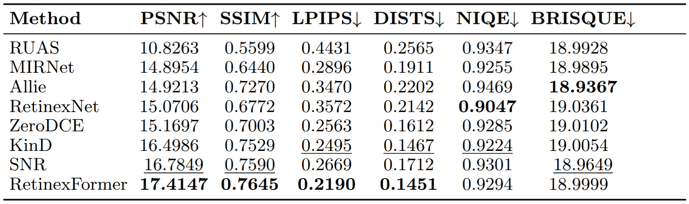
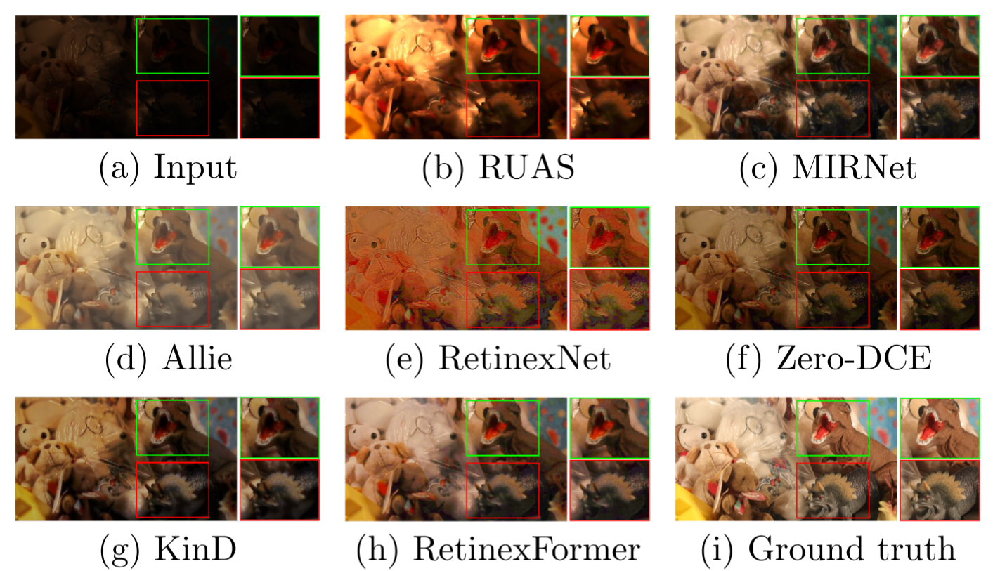

# CLID - Controlled Low-Light Image Dataset

CLID (Controlled Low-light Image Dataset) is a dataset designed for **low-light image enhancement research**, in which illumination is treated as an **explicitly controlled variable during image acquisition** rather than being simulated through exposure manipulation or synthetic degradation.

The dataset provides paired low-light and reference RGB images acquired under controlled physical illumination conditions, enabling reproducible and fine-grained analysis of how different lighting factors affect image formation and the performance of low-light image enhancement methods.

CLID comprises **1,250 image pairs across 125 distinct scenes**, with systematic variations in illumination type, illumination intensity, and number of active light sources. Low-light conditions are physically produced during image acquisition, while the corresponding reference images are captured under full or near-full illumination.

<div align="center">

### Dataset Variant: CID-LIE

A variant of this dataset is available as **CID-LIE (Controlled Illumination Dataset for Low-Light Image Enhancement)**.

[](https://github.com/parrotufam/CID-LIE)

</div>

---

## Dataset Overview

| Property                 | Description                               |
| ------------------------ | ----------------------------------------- |
| **Dataset**              | Controlled Low-Light Image Dataset (CLID) |
| **Task**                 | Low-light image enhancement               |
| **Image pairs**          | 1,250                                     |
| **Scenes**               | 125                                       |
| **Image type**           | RGB                                       |
| **Original resolution**  | 2400 × 1344 pixels                        |
| **Provided resolution**  | 600 × 336 pixels                          |
| **Format**               | JPEG                                      |
| **Acquisition**          | Controlled indoor environment             |
| **Low-light generation** | Physical illumination control             |
| **Reference images**     | Full or near-full illumination            |
| **Data split**           | TRAIN / TEST                              |

The original images were captured at **2400 × 1344 pixels** and stored in JPEG format. A resized version at **600 × 336 pixels** is also provided to facilitate training and experimentation. The dataset is divided into disjoint training and testing sets.

---

## Dataset Structure

The dataset is organized into separate **training** and **testing** splits. Each split contains low-light images (`RAW`) and their corresponding reference images (`REFERENCE`).

```text
CLID/
│
├── TRAIN/
│   ├── RAW/
│   └── REFERENCE/
│
└── TEST/
    ├── RAW/
    └── REFERENCE/
```

| Directory    | Description                                                                   |
| ------------ | ----------------------------------------------------------------------------- |
| `TRAIN/`     | Training split of the dataset.                                                |
| `TEST/`      | Testing split used for evaluation and benchmarking.                           |
| `RAW/`       | Low-light images acquired under controlled illumination conditions.           |
| `REFERENCE/` | Corresponding reference images acquired under full or near-full illumination. |

Each image in `RAW/` has a corresponding image with the **same filename** in `REFERENCE/`.

For example:

```text
TRAIN/
├── RAW/
│   ├── image_001.jpg
│   ├── image_002.jpg
│   └── ...
│
└── REFERENCE/
    ├── image_001.jpg
    ├── image_002.jpg
    └── ...
```

This organization preserves the direct correspondence between each low-light observation and its reference image, supporting supervised training and full-reference evaluation.

---

## Dataset Examples

The following examples illustrate the controlled illumination conditions used during image acquisition.

### INC



**Figure 1.** Example images from CLID captured under controlled **INC (Incandescent)** illumination. Images (a)–(e) represent different illumination levels, while image (f) corresponds to the reference image for the scene.

### CWF



**Figure 2.** Example images from CLID captured under controlled **CWF (Cool White Fluorescent)** illumination. Images (a)–(e) represent different illumination levels, while image (f) corresponds to the reference image for the scene.

---

## Controlled Illumination

A central characteristic of CLID is that low-light conditions are **physically generated during image acquisition** rather than synthetically produced through post-processing.

Images were acquired using the **SpectriWave® Manual Reflective Lighting system**, which provides direct and independent control over illumination parameters. The acquisition environment was fully blacked out to minimize uncontrolled external illumination.

Two illumination types were considered:

* **INC (Incandescent)** - warm illumination
* **CWF (Cool White Fluorescent)** - representative of office and laboratory environments

For each illumination type, the intensity and number of active light sources were systematically varied. The illumination types were not mixed within a single acquisition.

### Illumination Intensity

| Light Type | Intensity Levels |
| ---------- | ---------------- |
| **INC**    | 20, 40, 70, 100  |
| **CWF**    | 35, 50, 75, 100  |

### Number of Active Light Sources

| Light Type | Number of Lamps |
| ---------- | --------------- |
| **INC**    | 4, 8, 16        |
| **CWF**    | 2, 4, 6         |

These controlled variations allow the effects of **illumination type, intensity, and number of active light sources** to be investigated independently.

---

## Image Acquisition

Images were captured using a **Canon EOS Rebel SL3** mounted on a tripod to maintain geometric consistency across acquisitions.

The acquisition protocol included:

* Fixed camera position using a tripod
* Wireless remote triggering
* Automatic camera corrections disabled
* Manually fixed white balance
* ISO constrained between **100 and 400**
* Controlled indoor environment
* Physically controlled illumination

These procedures were adopted to reduce variations unrelated to illumination and maintain consistency across images acquired under different lighting conditions.

<table>
  <tr>
    <td align="center">
      
    </td>
    <td align="center">
      
    </td>
  </tr>
  <tr>
    <td align="center">Controlled lighting system</td>
    <td align="center">Camera setup</td>
  </tr>
</table>

**Figure 3.** Experimental setup used for CLID image acquisition, including the controlled lighting system and camera positioning.

---

## Scene Composition and Diversity

CLID contains **125 distinct scenes** designed to provide visual diversity while maintaining acquisition consistency.

The scenes include objects with different:

* Colors
* Textures
* Materials
* Reflectance properties
* Depth planes
* Backgrounds

The dataset includes materials such as:

* Glass
* Metal
* Plastic
* Fabric
* Paper
* Organic surfaces

These materials introduce different light interactions, including reflection, absorption, translucency, and specular highlights. Object positioning and framing remain consistent within each scene so that differences between paired images are primarily associated with illumination changes.

---

## Applications

CLID can be used for research in:

* Low-light image enhancement
* Image restoration
* Illumination compensation
* Image quality assessment
* Computer vision under controlled illumination
* Object recognition under varying illumination
* Object detection under varying illumination
* Perceptual quality assessment

The controlled acquisition protocol allows enhancement methods to be evaluated across specific illumination dimensions instead of treating low-light conditions as a single undifferentiated degradation.

---

## Benchmark

CLID was evaluated as a benchmark for **low-light image enhancement under controlled illumination conditions**.

The benchmark considers a low-light image $I_{low}$ and its corresponding full-illumination reference \$I_{ref}$. An enhancement method produces an enhanced image:

$$
\hat{I} = f(I_{low})
$$

The output is then compared with the corresponding reference image to evaluate restoration quality.

### Compared Methods

The benchmark includes representative low-light image enhancement methods:

* **RUAS**
* **MIRNet**
* **Allie**
* **RetinexNet**
* **Zero-DCE**
* **KinD**
* **SNR**
* **RetinexFormer**

All methods were evaluated in a **zero-shot setting**, using publicly available pretrained weights, primarily trained on LOL, without fine-tuning on CLID. This evaluation protocol is intended to assess generalization to the controlled illumination conditions represented by CLID.

### Evaluation Metrics

The benchmark uses both **full-reference** and **no-reference** image quality metrics.

| Category       | Metric      | Description                            | Direction          |
| -------------- | ----------- | -------------------------------------- | ------------------ |
| Full-reference | **PSNR**    | Pixel-level reconstruction fidelity    | ↑ Higher is better |
| Full-reference | **SSIM**    | Structural similarity                  | ↑ Higher is better |
| Full-reference | **LPIPS**   | Deep perceptual similarity             | ↓ Lower is better  |
| Full-reference | **DISTS**   | Deep structural and texture similarity | ↓ Lower is better  |
| No-reference   | **NIQE**    | Natural image quality assessment       | ↓ Lower is better  |
| No-reference   | **BRISQUE** | Blind image spatial quality assessment | ↓ Lower is better  |

Full-reference metrics compare the enhanced output with its corresponding reference image, while no-reference metrics evaluate the perceptual characteristics of the enhanced output without requiring a reference image.

### Quantitative Results

The quantitative evaluation is performed across the evaluation set, with each metric computed independently for each image and then averaged across the evaluated samples.



**Figure 4.** Quantitative benchmark results obtained on CLID using full-reference and no-reference image quality metrics.

The reported benchmark results are based on the experiments presented in the associated publication.

### Qualitative Results

The qualitative evaluation compares the enhanced outputs with the corresponding full-illumination references and examines representative regions containing textured, chromatic, and extremely dark areas.



**Figure 5.** Qualitative comparison of low-light image enhancement methods on CLID. The comparison includes the low-light input, enhanced outputs, and the corresponding full-illumination reference.

The qualitative examples illustrate different restoration behaviors under controlled low-light conditions, including color shifts, saturation, residual under-exposure, smoothing, and artifact amplification.

---

## Citation

If you use CLID in your research, please cite:

```bibtex
@inproceedings{rodrigues2026clid,
  title     = {CLID: Controlled Low-Light Image Dataset},
  author    = {Rodrigues, Gabrielly F. and
               Santos, Jade A. M. and
               Brito, Alternei S. and
               Cavalcanti, Jo{\~a}o M. B. and
               Pio, Jos{\'e} L. S. and
               Oliveira, Felipe G.},
  booktitle = {International Conference on Pattern Recognition (ICPR)},
  year      = {2026}
}
```
